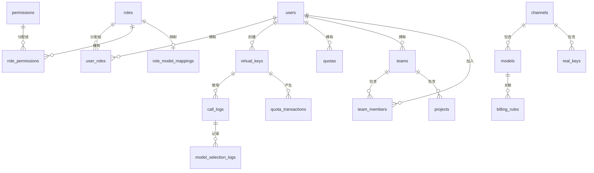
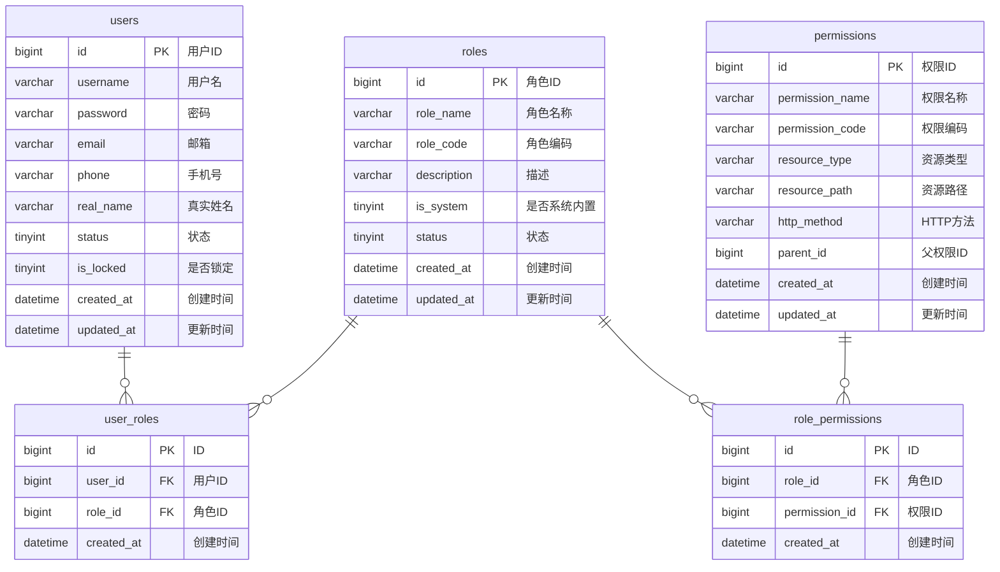
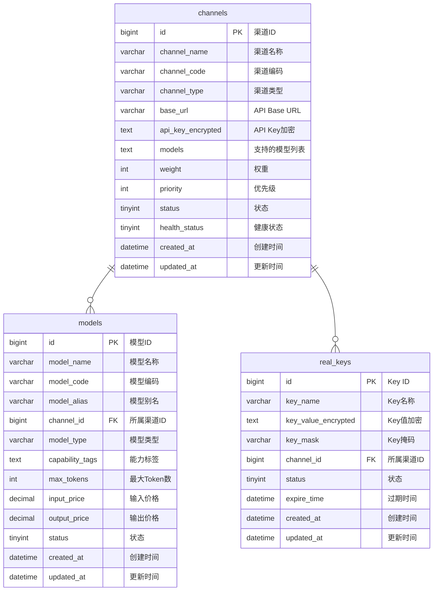
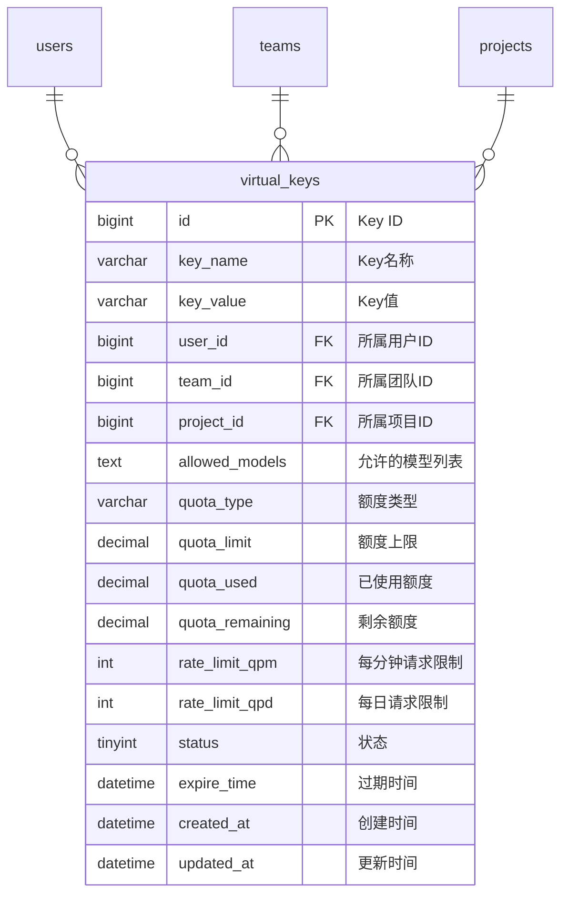
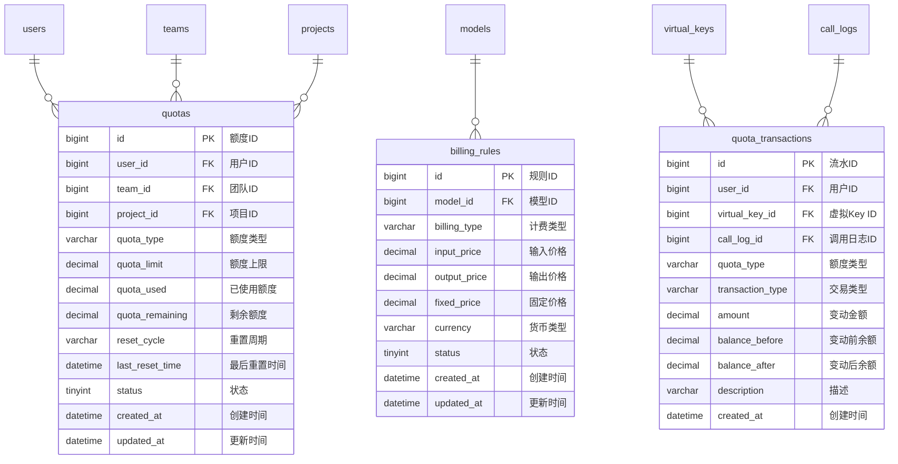
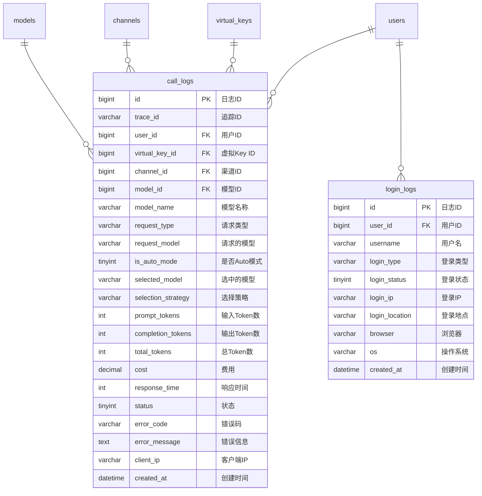
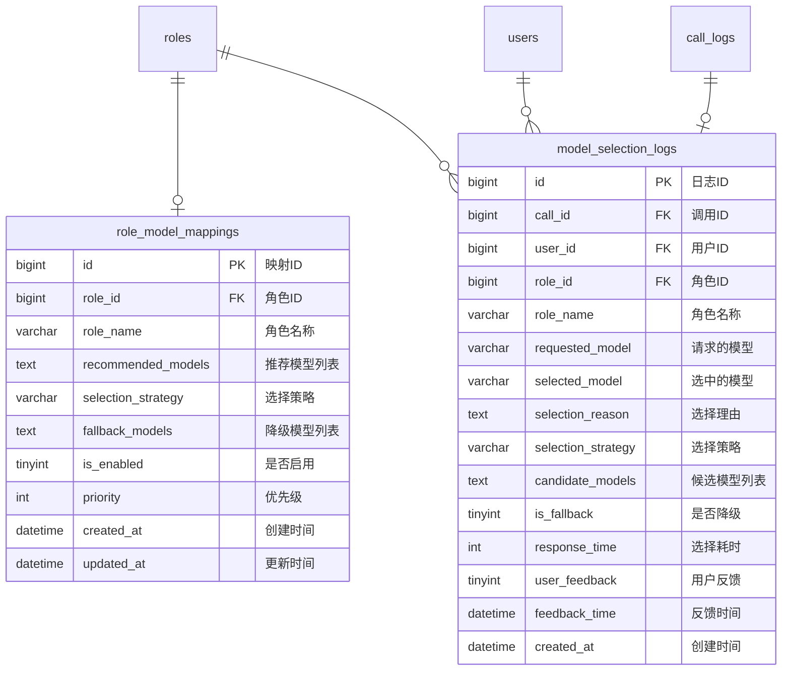
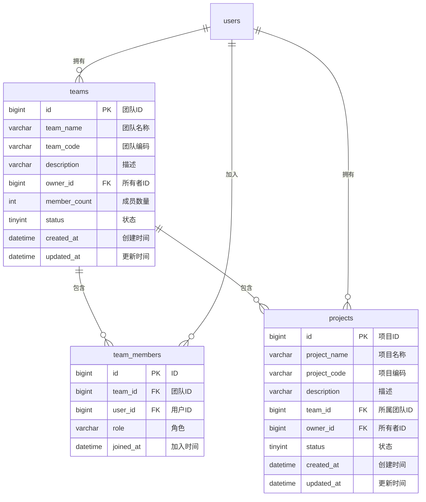

# 数据库ER图设计文档

## 文档信息
- **项目名称:** AI调度中心 - 企业API Key管理系统
- **文档版本:** V1.0
- **创建时间:** 2026-03-30
- **数据库类型:** MySQL 8.0+

## 一、数据库概述

本系统数据库设计遵循以下原则：
1. 使用MySQL 8.0+特性
2. 表名使用下划线命名法
3. 所有表必须包含 `created_at` 和 `updated_at` 字段
4. 敏感字段使用TEXT类型存储加密数据
5. 支持逻辑删除（`deleted` 字段）
6. 使用外键约束保证数据完整性

## 二、ER图

### 2.1 核心实体关系图



### 2.2 用户权限模块



### 2.3 渠道模型模块



### 2.4 APIKey管理模块



### 2.5 额度计费模块



### 2.6 日志监控模块



### 2.7 Auto模式模块



### 2.8 团队项目模块



## 三、表清单

| 序号 | 表名 | 中文名称 | 说明 |
|------|------|----------|------|
| 1 | users | 用户表 | 存储用户基本信息 |
| 2 | roles | 角色表 | 存储角色信息 |
| 3 | permissions | 权限表 | 存储权限信息 |
| 4 | user_roles | 用户角色关联表 | 用户与角色的多对多关系 |
| 5 | role_permissions | 角色权限关联表 | 角色与权限的多对多关系 |
| 6 | channels | 渠道表 | 存储模型厂商渠道信息 |
| 7 | models | 模型表 | 存储模型信息 |
| 8 | real_keys | 真实Key表 | 存储真实API Key（加密） |
| 9 | virtual_keys | 虚拟Key表 | 存储虚拟Key信息 |
| 10 | quotas | 额度表 | 存储用户/团队/项目额度 |
| 11 | billing_rules | 计费规则表 | 存储模型计费规则 |
| 12 | quota_transactions | 额度流水表 | 记录额度变动流水 |
| 13 | call_logs | 调用日志表 | 记录模型调用日志 |
| 14 | login_logs | 登录日志表 | 记录用户登录日志 |
| 15 | teams | 团队表 | 存储团队信息 |
| 16 | team_members | 团队成员表 | 团队与用户的多对多关系 |
| 17 | projects | 项目表 | 存储项目信息 |
| 18 | role_model_mappings | 角色模型映射表 | Auto模式角色与模型的映射 |
| 19 | model_selection_logs | 模型选择日志表 | 记录Auto模式选择日志 |
| 20 | system_configs | 系统配置表 | 存储系统配置 |
| 21 | alert_rules | 告警规则表 | 存储告警规则 |
| 22 | alert_histories | 告警历史表 | 记录告警历史 |

## 四、索引设计

### 4.1 主键索引
所有表均使用自增主键 `id`。

### 4.2 唯一索引
| 表名 | 索引名 | 字段 | 说明 |
|------|--------|------|------|
| users | uk_username | username | 用户名唯一 |
| users | uk_email | email | 邮箱唯一 |
| roles | uk_role_code | role_code | 角色编码唯一 |
| permissions | uk_permission_code | permission_code | 权限编码唯一 |
| user_roles | uk_user_role | user_id, role_id | 用户角色关联唯一 |
| role_permissions | uk_role_permission | role_id, permission_id | 角色权限关联唯一 |
| channels | uk_channel_code | channel_code | 渠道编码唯一 |
| models | uk_model_code_channel | model_code, channel_id | 模型编码渠道唯一 |
| virtual_keys | uk_key_value | key_value | Key值唯一 |
| teams | uk_team_code | team_code | 团队编码唯一 |
| team_members | uk_team_user | team_id, user_id | 团队用户关联唯一 |
| projects | uk_project_code | project_code | 项目编码唯一 |
| role_model_mappings | uk_role_id | role_id | 角色ID唯一 |
| call_logs | uk_trace_id | trace_id | 追踪ID唯一 |
| system_configs | uk_config_group_key | config_group, config_key | 配置键唯一 |

### 4.3 普通索引
| 表名 | 索引名 | 字段 | 说明 |
|------|--------|------|------|
| users | idx_status | status | 状态索引 |
| users | idx_created_at | created_at | 创建时间索引 |
| channels | idx_channel_type | channel_type | 渠道类型索引 |
| channels | idx_status | status | 状态索引 |
| channels | idx_health_status | health_status | 健康状态索引 |
| models | idx_channel_id | channel_id | 渠道ID索引 |
| models | idx_model_type | model_type | 模型类型索引 |
| models | idx_status | status | 状态索引 |
| virtual_keys | idx_user_id | user_id | 用户ID索引 |
| virtual_keys | idx_team_id | team_id | 团队ID索引 |
| virtual_keys | idx_project_id | project_id | 项目ID索引 |
| virtual_keys | idx_status | status | 状态索引 |
| call_logs | idx_user_id | user_id | 用户ID索引 |
| call_logs | idx_channel_id | channel_id | 渠道ID索引 |
| call_logs | idx_model_id | model_id | 模型ID索引 |
| call_logs | idx_created_at | created_at | 创建时间索引 |
| call_logs | idx_is_auto_mode | is_auto_mode | Auto模式索引 |
| model_selection_logs | idx_user_id | user_id | 用户ID索引 |
| model_selection_logs | idx_role_id | role_id | 角色ID索引 |
| model_selection_logs | idx_created_at | created_at | 创建时间索引 |

## 五、外键约束

| 表名 | 外键名 | 字段 | 引用表 | 引用字段 | 删除规则 |
|------|--------|------|--------|----------|----------|
| user_roles | fk_user_roles_user | user_id | users | id | CASCADE |
| user_roles | fk_user_roles_role | role_id | roles | id | CASCADE |
| role_permissions | fk_role_permissions_role | role_id | roles | id | CASCADE |
| role_permissions | fk_role_permissions_permission | permission_id | permissions | id | CASCADE |
| models | fk_models_channel | channel_id | channels | id | CASCADE |
| real_keys | fk_real_keys_channel | channel_id | channels | id | CASCADE |
| virtual_keys | fk_virtual_keys_user | user_id | users | id | CASCADE |
| billing_rules | fk_billing_rules_model | model_id | models | id | CASCADE |
| teams | fk_teams_owner | owner_id | users | id | CASCADE |
| team_members | fk_team_members_team | team_id | teams | id | CASCADE |
| team_members | fk_team_members_user | user_id | users | id | CASCADE |
| projects | fk_projects_team | team_id | teams | id | SET NULL |
| projects | fk_projects_owner | owner_id | users | id | CASCADE |
| role_model_mappings | fk_role_model_mappings_role | role_id | roles | id | CASCADE |

## 六、数据字典

### 6.1 状态枚举

#### 通用状态 (status)
- 0: 禁用
- 1: 启用

#### 渠道状态 (channels.status)
- 0: 禁用
- 1: 启用
- 2: 维护中

#### 健康状态 (channels.health_status)
- 0: 不健康
- 1: 健康

#### 登录状态 (login_logs.login_status)
- 0: 失败
- 1: 成功

#### 调用状态 (call_logs.status)
- 0: 失败
- 1: 成功

### 6.2 类型枚举

#### 额度类型 (quota_type)
- token: Token额度
- count: 调用次数额度
- amount: 金额额度

#### 计费类型 (billing_type)
- token: 按Token计费
- count: 按次计费

#### 请求类型 (request_type)
- chat: 聊天
- embedding: 嵌入
- image: 图像

#### 选择策略 (selection_strategy)
- PERFORMANCE_FIRST: 性能优先
- COST_FIRST: 成本优先
- AVAILABILITY_FIRST: 可用性优先
- BALANCED: 均衡

#### 交易类型 (transaction_type)
- consume: 消费
- recharge: 充值
- refund: 退款
- adjust: 调整

#### 资源类型 (resource_type)
- menu: 菜单
- button: 按钮
- api: 接口

#### 模型类型 (model_type)
- chat: 聊天模型
- embedding: 嵌入模型
- image: 图像模型

#### 渠道类型 (channel_type)
- openai: OpenAI
- qwen: 通义千问
- wenxin: 文心一言
- doubao: 豆包
- claude: Claude
- gemini: Gemini
- deepseek: DeepSeek

## 七、数据库脚本说明

### 7.1 脚本文件
- `schema.sql`: 数据库表结构DDL脚本
- `data.sql`: 初始数据DML脚本

### 7.2 执行顺序
1. 先执行 `schema.sql` 创建表结构
2. 再执行 `data.sql` 插入初始数据

### 7.3 执行命令
```bash
# 创建数据库
mysql -u root -p -e "CREATE DATABASE ai_key_management DEFAULT CHARACTER SET utf8mb4 COLLATE utf8mb4_unicode_ci;"

# 执行DDL脚本
mysql -u root -p ai_key_management < backend/src/main/resources/db/schema.sql

# 执行初始数据脚本
mysql -u root -p ai_key_management < backend/src/main/resources/db/data.sql
```

## 八、设计说明

### 8.1 Auto模式设计
Auto模式是本系统的核心特性之一，支持智能模型选择：

1. **角色模型映射表 (role_model_mappings)**
   - 定义角色与推荐模型的映射关系
   - 支持多种选择策略（性能优先、成本优先、可用性优先、均衡）
   - 支持降级模型列表

2. **模型选择日志表 (model_selection_logs)**
   - 记录每次智能选择的决策过程
   - 支持用户反馈（满意/不满意）
   - 用于准确率评估和优化

3. **调用日志表增强 (call_logs)**
   - 增加 `is_auto_mode` 字段标识是否使用Auto模式
   - 增加 `selected_model` 字段记录选中的模型
   - 增加 `selection_strategy` 字段记录选择策略

### 8.2 安全设计
1. **密码加密**: 使用BCrypt加密存储
2. **API Key加密**: 使用AES-256加密存储
3. **敏感字段脱敏**: 日志记录时脱敏处理
4. **登录失败锁定**: 连续失败N次锁定账户

### 8.3 性能设计
1. **索引优化**: 为高频查询字段创建索引
2. **分区表**: 日志表按时间分区（待实现）
3. **缓存策略**: 使用Redis缓存热点数据
4. **异步处理**: 日志记录、额度扣减异步处理

### 8.4 扩展性设计
1. **JSON字段**: 使用JSON存储灵活配置（如能力标签、配置信息）
2. **逻辑删除**: 支持数据恢复
3. **审计字段**: created_at、updated_at支持审计追踪

---

**文档版本:** V1.0  
**创建日期:** 2026-03-30  
**最后更新:** 2026-03-30  
**状态:** 已完成
